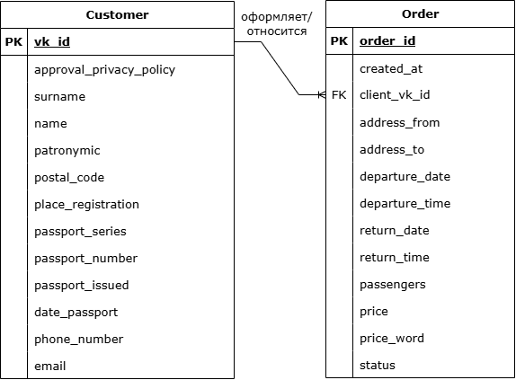

# Database Design

## Назначение базы данных

База данных предназначена для централизованного хранения информации о заказчиках и оформленных заказах. Она обеспечивает сохранность данных, исключает их дублирование и позволяет использовать сведения при оформлении новых заказов, формировании заказ-нарядов и просмотре истории перевозок.

## ER-диаграмма

## Сущности

### Заказчик (Customer)

Хранит персональные и контактные данные заказчиков.

| Поле | Описание |
|------|----------|
| vk_id | Уникальный идентификатор заказчика |
| approval_privacy_policy | Отметка о согласии на обработку ПДн |
| surname | Фамилия заказчика |
| name | Имя заказчика |
| patronymic | Отчество заказчика |
| postal_code | Почтовый индекс |
| place_registration | Адрес регистрации |
| passport_series | Серия паспорта |
| passport_number | Номер паспорта |
| passport_issued | Наименование органа, выдавшего паспорт |
| date_passport | Дата выдачи паспорта |
| phone_number | Контактный телефон |
| email | Адрес электронной почты |

### Заказ (Order)

Хранит сведения об оформленных заказах на перевозку.

| Поле | Описание |
|------|----------|
| order_id | Уникальный идентификатор заказа |
| created_at | Дата оформления заказа |
| client_vk_id | Идентификатор заказчика |
| address_from | Место отправления |
| address_to | Место назначения |
| departure_date | Дата отправления |
| departure_time | Время отправления |
| return_date | Дата возвращения |
| return_time | Время возвращения |
| passengers | Количество пассажиров |
| price | Стоимость перевозки |
| price_word | Стоимость перевозки прописью для вставки в шаблон заказ-наряда | 
| status | Текущий статус заказа |

## Связи между сущностями

База данных содержит две основные сущности: **Customer** и **Order**.

Между сущностями реализована связь **«один ко многим» (1:N)**:

- один заказчик может оформить несколько заказов;
- каждый заказ принадлежит только одному заказчику.

Такая структура позволяет избежать дублирования персональных данных и обеспечивает возможность хранения истории заказов каждого клиента.
